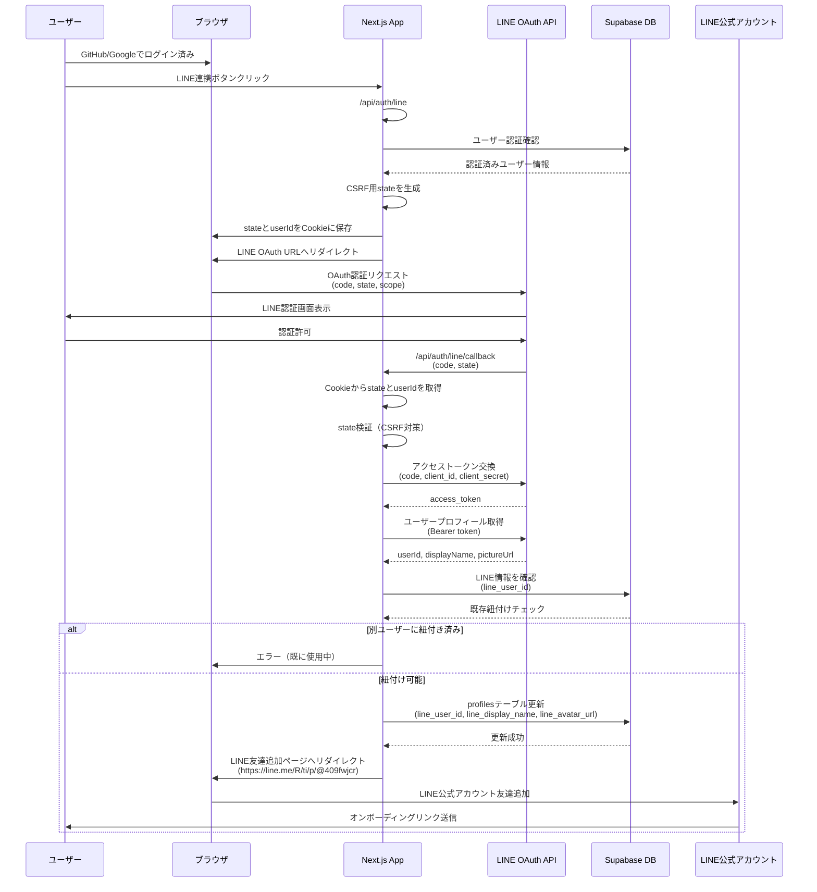
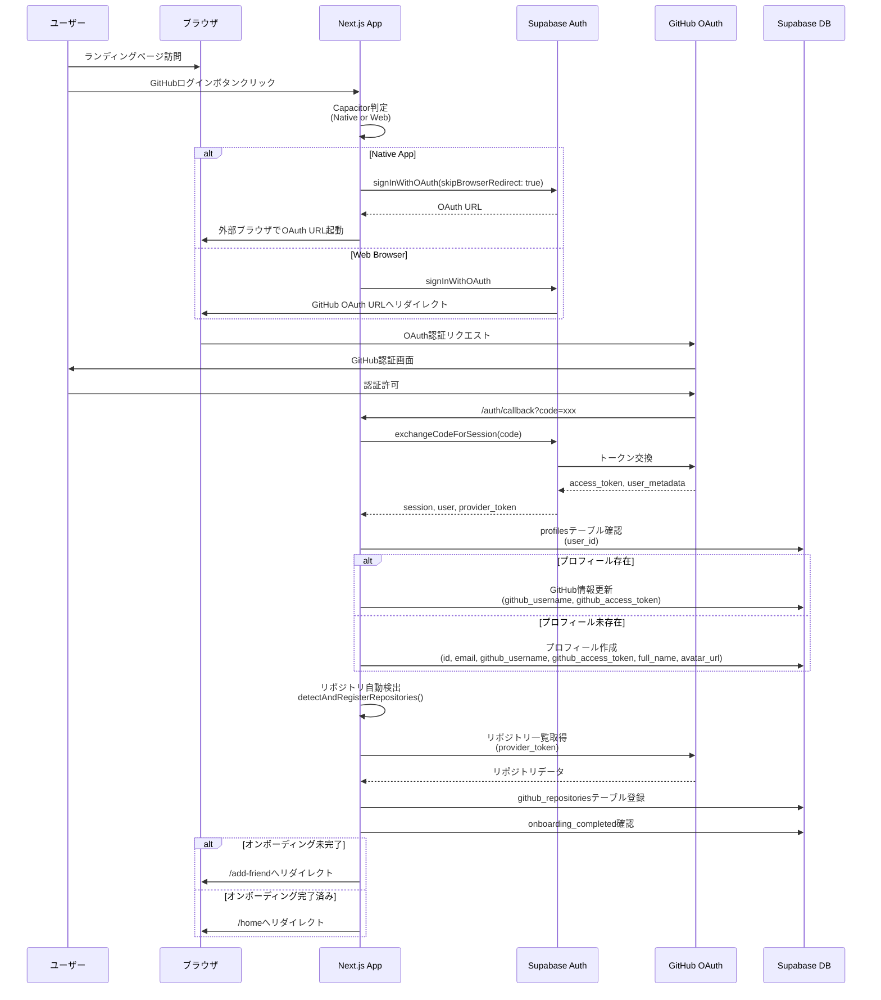

# システムアーキテクチャ図

このドキュメントには、UniPathFinderシステム全体のアーキテクチャとフローを示すマーメイド図が含まれています。

## 目次
1. [LINEの認証フロー](#1-lineの認証フロー)
2. [GitHubの認証フロー](#2-githubの認証フロー)
3. [データベースの構成](#3-データベースの構成)
4. [アプリのコンポーネントごとのフローや役割関わり合い](#4-アプリのコンポーネントごとのフローや役割関わり合い)

---

## 1. LINEの認証フロー



### フローの説明

1. **前提条件**: ユーザーは既にGitHubまたはGoogleで認証済み
2. **OAuth開始**: `/api/auth/line` でCSRF対策のstateを生成し、Cookieに保存
3. **LINE認証**: ユーザーがLINE OAuth画面で認証を許可
4. **コールバック処理**: `/api/auth/line/callback` でstateを検証し、アクセストークンを取得
5. **プロフィール取得**: LINE APIからユーザー情報を取得
6. **重複チェック**: 同じLINE IDが既に別のアカウントに紐付いていないか確認
7. **データ保存**: profilesテーブルにLINE情報を保存
8. **友達追加**: LINE公式アカウントの友達追加ページへリダイレクト

---

## 2. GitHubの認証フロー



### フローの説明

1. **プラットフォーム判定**: Capacitorを使用してネイティブアプリかWebブラウザかを判定
2. **OAuth開始**: Supabase AuthでGitHub OAuth URLを生成
3. **認証**: GitHubでユーザーが認証を許可
4. **トークン交換**: `/auth/callback` で認証コードをセッショントークンに交換
5. **プロフィール管理**:
   - 既存ユーザー: GitHub情報を更新
   - 新規ユーザー: プロフィールを作成
6. **リポジトリ検出**: GitHub APIから自動的にリポジトリを検出・登録
7. **リダイレクト**:
   - オンボーディング未完了 → `/add-friend`
   - オンボーディング完了済み → `/home`

---

## 3. データベースの構成

```mermaid
erDiagram
    auth_users ||--|| profiles : "1:1"
    profiles ||--o{ tech_blog_posts : "1:N"
    profiles ||--o{ github_daily_stats : "1:N"
    profiles ||--o{ chat_sessions : "1:N"
    chat_sessions ||--o{ chat_messages : "1:N"
    profiles ||--o{ ai_mentor_notifications : "1:N"
    profiles ||--o{ line_push_errors : "1:N"
    profiles ||--o{ github_repositories : "1:N"
    profiles ||--|| user_engagement_status : "1:1"
    ai_mentor_notifications ||--o| line_push_errors : "1:N"

    auth_users {
        uuid id PK
        string email
        jsonb app_metadata
        timestamp created_at
    }

    profiles {
        uuid id PK FK
        string email
        string full_name
        string username
        string avatar_url
        string bio
        string location
        string github_username
        string github_access_token
        string line_user_id UK
        string line_display_name
        string line_avatar_url
        boolean line_friend_added
        string twitter_username
        string linkedin_url
        string instagram_username
        string discord_username
        string youtube_url
        string facebook_url
        string portfolio_url
        string skills
        string interests
        string job_interest
        string skill_level
        string learning_goal
        boolean onboarding_completed
        timestamp created_at
        timestamp updated_at
    }

    tech_blog_posts {
        uuid id PK
        uuid user_id FK
        string title
        text content
        string topic
        string status
        vector embedding "1536-dim"
        timestamp created_at
        timestamp updated_at
    }

    github_daily_stats {
        uuid id PK
        uuid user_id FK
        date date
        int commit_count
        int push_event_count
        int issue_count
        int pull_request_count
        timestamp created_at
        timestamp updated_at
    }

    github_repositories {
        uuid id PK
        uuid user_id FK
        string repo_name
        string repo_url
        boolean is_primary
        timestamp created_at
    }

    chat_sessions {
        uuid id PK
        uuid user_id FK
        string title
        timestamp created_at
        timestamp updated_at
    }

    chat_messages {
        uuid id PK
        uuid session_id FK
        string role "user|assistant|system"
        text content
        timestamp created_at
    }

    user_engagement_status {
        uuid user_id PK FK
        int growth_score "0-100"
        text ai_analysis_summary
        timestamp last_analyzed_at
        timestamp created_at
        timestamp updated_at
    }

    ai_mentor_notifications {
        uuid id PK
        uuid user_id FK
        string notification_type "blog_post|github_sync"
        date notification_date
        text message
        int growth_score
        text analysis_summary
        boolean sent_successfully
        text error_message
        timestamp created_at
        timestamp sent_at
    }

    line_push_errors {
        uuid id PK
        uuid user_id FK
        string line_user_id
        text message
        string error_code
        text error_message
        uuid notification_id FK
        timestamp created_at
    }
```

### テーブル説明

#### コアテーブル
- **auth_users**: Supabase Authが管理する認証ユーザー情報
- **profiles**: ユーザープロフィール（SNS情報、スキル、キャリア目標など）

#### コンテンツテーブル
- **tech_blog_posts**: ユーザーが投稿した技術ブログ（OpenAI Embeddingsを含む）
- **github_daily_stats**: GitHubの日次アクティビティ統計（コミット数、PR数など）
- **github_repositories**: ユーザーのGitHubリポジトリ情報

#### AI機能テーブル
- **chat_sessions**: AI Mentorチャットのセッション管理
- **chat_messages**: チャットメッセージ履歴
- **user_engagement_status**: AI分析による成長スコアと分析サマリー
- **ai_mentor_notifications**: AI Mentorからの通知履歴（1日1回制限付き）
- **line_push_errors**: LINEプッシュメッセージ送信エラーログ

---

## 4. アプリのコンポーネントごとのフローや役割関わり合い

```mermaid
graph TB
    subgraph "Frontend - Pages"
        LP[Landing Page<br/>page.tsx]
        AF[Add Friend Page<br/>add-friend/page.tsx]
        OB[Onboarding<br/>onboarding/page.tsx]
        Home[Home Page<br/>home/page.tsx]
        Members[Members Page<br/>members/page.tsx]
        Dashboard[Dashboard<br/>dashboard/page.tsx]
        Settings[Settings<br/>settings/page.tsx]
        AIChat[AI Chat<br/>ai-chat/page.tsx]
    end

    subgraph "Components"
        ML[MainLayout]
        SB[Sidebar]
        TP[ThemeProvider]
        ADL[AuthDeepLinkHandler]
        PGC[PersonalGrowthChart]
        MS[MilestoneShowcase]
        WS[WeeklySnapshot]
    end

    subgraph "API Routes - Auth"
        GitHubCB[/auth/callback<br/>GitHub/Google/LINE]
        LineAuth[/api/auth/line<br/>LINE OAuth開始]
        LineCB[/api/auth/line/callback<br/>LINE コールバック]
        SignOut[/auth/signout<br/>ログアウト]
    end

    subgraph "API Routes - GitHub"
        SyncStats[/api/github/sync-daily-stats<br/>GitHubデータ同期]
        DashData[/api/github/dashboard-data<br/>ダッシュボードデータ]
    end

    subgraph "API Routes - AI"
        ChatAPI[/api/chat<br/>AI Mentorチャット]
        AnalyzePost[/api/ai-mentor/analyze-post<br/>ブログ投稿分析]
    end

    subgraph "API Routes - LINE"
        LineWebhook[/api/webhooks/line<br/>LINE Webhook]
    end

    subgraph "Utilities & Libraries"
        SupabaseClient[Supabase Client]
        SupabaseServer[Supabase Server]
        GitHubDetector[github-repo-detector]
        GitHubAnalyzer[github-commit-analyzer]
        GitHubSummary[github-summary-generator]
        AIMentor[ai-mentor]
    end

    subgraph "External Services"
        SupabaseDB[(Supabase Database)]
        GitHubAPI[GitHub API]
        LineAPI[LINE API]
        OpenAI[OpenAI API]
    end

    %% Landing Page Flow
    LP -->|GitHub/Google Login| GitHubCB
    LP -->|Theme Toggle| TP
    GitHubCB -->|New User| AF
    GitHubCB -->|Existing User| Home
    AF -->|Friend Added| OB
    OB -->|Complete| Home

    %% Main App Flow
    Home -->|Layout| ML
    Members -->|Layout| ML
    Dashboard -->|Layout| ML
    Settings -->|Layout| ML
    AIChat -->|Layout| ML

    ML -->|Navigation| SB
    ML -->|Theme| TP

    %% Dashboard Components
    Dashboard -->|Charts| PGC
    Dashboard -->|Milestones| MS
    Dashboard -->|Weekly Stats| WS

    %% API Interactions
    Home -->|Blog CRUD| SupabaseClient
    Home -->|LINE Link| LineAuth
    LineAuth -->|OAuth Flow| LineCB
    LineCB -->|Save Profile| SupabaseDB

    Members -->|Fetch Users| SupabaseClient

    Dashboard -->|Fetch Stats| DashData
    DashData -->|Read| SupabaseServer

    Settings -->|Update Profile| SupabaseClient

    AIChat -->|Send Message| ChatAPI
    ChatAPI -->|AI Response| OpenAI
    ChatAPI -->|Save History| SupabaseDB

    %% GitHub Integration
    GitHubCB -->|Auto Detect Repos| GitHubDetector
    GitHubDetector -->|GitHub API| GitHubAPI
    GitHubDetector -->|Save Repos| SupabaseDB

    SyncStats -->|Fetch Events| GitHubAPI
    SyncStats -->|Analyze| GitHubAnalyzer
    SyncStats -->|Generate Summary| GitHubSummary
    SyncStats -->|Store| SupabaseDB

    %% AI Mentor Flow
    Home -->|Analyze Post| AnalyzePost
    AnalyzePost -->|OpenAI| AIMentor
    AIMentor -->|GPT-4| OpenAI
    AIMentor -->|Embeddings| OpenAI
    AIMentor -->|Save Analysis| SupabaseDB
    AIMentor -->|LINE Push| LineAPI

    %% LINE Webhook
    LineAPI -->|Friend Add Event| LineWebhook
    LineWebhook -->|Update Profile| SupabaseDB

    %% Data Access
    SupabaseClient -->|CRUD| SupabaseDB
    SupabaseServer -->|CRUD| SupabaseDB

    %% Deep Link Handler
    ADL -->|Handle Auth| GitHubCB

    style LP fill:#e1f5ff
    style AF fill:#e1f5ff
    style OB fill:#e1f5ff
    style Home fill:#e1f5ff
    style Dashboard fill:#e1f5ff
    style AIChat fill:#fff4e1
    style ChatAPI fill:#fff4e1
    style AIMentor fill:#fff4e1
    style OpenAI fill:#ffe1e1
    style GitHubAPI fill:#ffe1e1
    style LineAPI fill:#ffe1e1
    style SupabaseDB fill:#e1ffe1
```

### コンポーネント役割

#### Pages (ページ)
- **Landing Page**: ログイン前のトップページ（GitHub/Google OAuth開始）
- **Add Friend Page**: LINE公式アカウント友達追加案内
- **Onboarding**: 初回登録時のオンボーディングフロー
- **Home Page**: メインダッシュボード（プロフィール、技術ブログCRUD）
- **Members Page**: 登録学生一覧とフィルター機能
- **Dashboard**: GitHubアクティビティ可視化（グラフ、マイルストーン）
- **Settings**: プロフィール設定（SNS連携、スキル情報）
- **AI Chat**: AI Mentorとのチャット機能

#### Components (共通コンポーネント)
- **MainLayout**: 認証済みページの共通レイアウト
- **Sidebar**: ナビゲーションヘッダー
- **ThemeProvider**: ダークモード管理
- **AuthDeepLinkHandler**: 認証ディープリンクハンドラ
- **PersonalGrowthChart**: 成長チャート
- **MilestoneShowcase**: マイルストーン表示
- **WeeklySnapshot**: 週次統計表示

#### API Routes
- **Auth**: GitHub/Google/LINE OAuth処理、ログアウト
- **GitHub**: GitHubデータ同期、ダッシュボードデータ取得
- **AI**: チャット、ブログ投稿分析
- **LINE**: Webhook（友達追加イベント処理）

#### Utilities
- **github-repo-detector**: GitHubリポジトリ自動検出
- **github-commit-analyzer**: コミット分析
- **github-summary-generator**: GitHub活動サマリー生成
- **ai-mentor**: AI分析とLINE通知送信

#### External Services
- **Supabase Database**: PostgreSQL（RLS有効）
- **GitHub API**: リポジトリ、イベントデータ取得
- **LINE API**: OAuth、プッシュメッセージ、Webhook
- **OpenAI API**: GPT-4チャット、Embeddings生成

---

## 主要なデータフロー

### 1. 新規ユーザー登録フロー
```
Landing Page → GitHub OAuth → /auth/callback
→ Profile作成 → Repo自動検出 → /add-friend
→ LINE友達追加 → Webhook → /onboarding → /home
```

### 2. ブログ投稿 + AI分析フロー
```
Home (投稿) → Supabase (保存) → AI Mentor API
→ OpenAI (分析 + Embedding) → Supabase (保存)
→ LINE API (通知送信)
```

### 3. GitHub同期フロー
```
Cron Job → /api/github/sync-daily-stats → GitHub API
→ Commit Analyzer → Summary Generator → Supabase
→ AI Mentor → LINE通知
```

### 4. AI Chatフロー
```
AI Chat Page → /api/chat → 過去履歴取得 → OpenAI GPT-4
→ Supabase (メッセージ保存) → レスポンス表示
```

---

## セキュリティ機能

### Row Level Security (RLS)
すべてのテーブルでRLSが有効化されており、ユーザーは自分のデータのみアクセス可能:
- `auth.uid() = user_id` ポリシーによる制限
- サービスロールのみが全データにアクセス可能

### CSRF対策
- LINE OAuth: state パラメータとCookie検証
- GitHub/Google OAuth: Supabase Auth内部で処理

### 認証トークン管理
- GitHub Access Token: 暗号化してprofilesテーブルに保存
- LINE Access Token: 一時的な使用のみ（保存なし）
- Supabase Session: HTTPOnly Cookieで管理

---

最終更新日: 2025年11月28日
